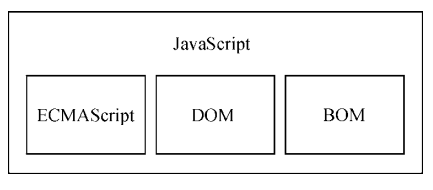
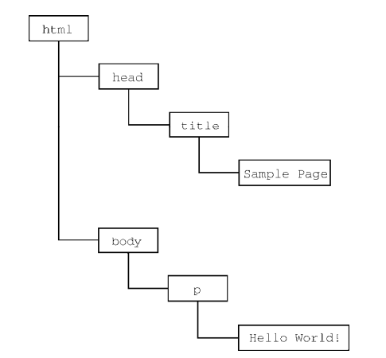

## 第1章 javaScript
### 1.1 js包含以下几个部分：
- 核心（ECMAScript）
- 文档对象模型（DOM）
- 浏览器对象模型（BOM）

1、DOM

文档对象模型（DOM，Document Object Model）是一个应用编程接口（API），用于在 HTML 中使
用扩展的 XML。DOM 将整个页面抽象为一组分层节点。HTML 或 XML 页面的每个组成部分都是一种
节点，包含不同的数据。

    <html>
     <head> 
        <title>Sample Page</title> 
     </head> 

     <body> 
        
 Hello World!
 
     </body> 
    </html>

DOM 通过创建表示文档的树，让开发者可以随心所欲地控制网页的内容和结构。使用 DOM API，
可以轻松地删除、添加、替换、修改节点。

## 总结
> JavaScript 是一门用来与网页交互的脚本语言，包含以下三个组成部分。
>- ECMAScript：由 ECMA-262 定义并提供核心功能。
>- 文档对象模型（DOM）：提供与网页内容交互的方法和接口。
>- 浏览器对象模型（BOM）：提供与浏览器交互的方法和接口。

>JavaScript 的这三个部分得到了五大 Web 浏览器（IE、Firefox、Chrome、Safari 和 Opera）不同程度
的支持。所有浏览器基本上对 ES5（ECMAScript 5）提供了完善的支持，而对 ES6（ECMAScript 6）和
ES7（ECMAScript 7）的支持度也在不断提升。这些浏览器对 DOM 的支持各不相同，但对 Level 3 的支
持日益趋于规范。HTML5 中收录的 BOM 会因浏览器而异，不过开发者仍然可以假定存在很大一部分
公共特性