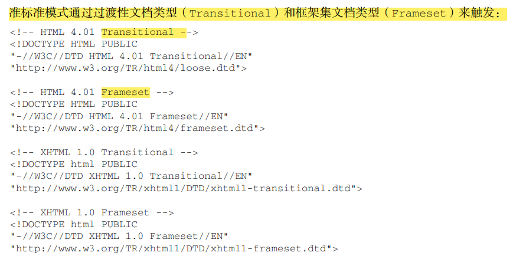

## 第2章 HTML中的javaScript
### 1.1 < script > 标签元素.：
#### 1.1.1 标签位置
> 把所有 JavaScript
文件都放在<head>里，也就意味着必须把所有 JavaScript 代码都下载、解析和解释完成后，才能开始渲
染页面（页面在浏览器解析到<body>的起始标签时开始渲染）。对于需要很多 JavaScript 的页面，这会
导致页面渲染的明显延迟，在此期间浏览器窗口完全空白。为解决这个问题，现代 Web 应用程序通常
将所有 JavaScript 引用放在<body>元素中的页面内容后面。
#### 1.1.2 推行执行脚本
HTML 4.01 为< script >元素定义了一个叫 defer 的属性.脚本会被延迟到整个页面都解析完毕后再运行。因此，在< script >元素上
设置 defer 属性，相当于告诉浏览器立即下载，但延迟执行。

    <!DOCTYPE html> 
    <html> 
     <head> 
        <title>Example HTML Page</title> 
         
         
     </head> 

     <body> 
     <!-- 这里是页面内容 --> 
     </body> 
    </html> 

虽然这个例子中的< script >元素包含在页面的< head >中，但它们会在浏览器解析到结束的
< /html >标签后才会执行。

- **defer 属性只对外部脚本文件才有效。**
- **对于 XHTML 文档，指定 defer 属性时应该写成 defer="defer"**

#### 1.1.3 异步执行脚本
    <!DOCTYPE html> 
    <html> 
     <head> 
     <title>Example HTML Page</title> 
      
      
     </head> 
     <body> 
     <!-- 这里是页面内容 --> 
     </body> 
    </html>
在这个例子中，第二个脚本可能先于第一个脚本执行。
- >async 和 defer属性它们两者也都只适用于外部脚本，都会告诉浏览器立即开始下载。
- > 注意 对于 XHTML 文档，指定 async 属性时应该写成 async="async"。

#### 1.1.4 动态加载脚本
除了< script >标签，还有其他方式可以加载脚本。因为 JavaScript 可以使用 DOM API，所以通过
向 DOM 中动态添加 script 元素同样可以加载指定的脚本。只要创建一个 script 元素并将其添加到
DOM 即可。

    let script = document.createElement('script'); 
    script.src = 'gibberish.js'; 
    document.head.appendChild(script);

默认情况下，
以这种方式创建的< script >元素是以异步方式加载的，相当于添加了 async 属性.

> 所有浏览器都支持 createElement()方法，但不是所有浏览器都支持 async 属性.
>因此，如果要统一动态脚本的加载行为，可以明确将其设置为同步加载：

      let script = document.createElement('script'); 
      script.src = 'gibberish.js'; 
      script.async = false; 
      document.head.appendChild(script);

#### 1.1.5 XHTML中的变化
1、可扩展超文本标记语言（XHTML，Extensible HyperText Markup Language）是将 HTML 作为 XML
的应用重新包装的结果。

2、与 HTML 不同，在 XHTML 中使用 JavaScript 必须指定 type 属性且值为
text/javascript。

### 2.2 行内代码与外部文件

最佳实践是尽可能将 JavaScript 代码放在外部文件中。
原因：

- 可维护性。JavaScript 代码如果分散到很多 HTML 页面，会导致维护困难。而用一个目录保存
所有 JavaScript 文件，则更容易维护，这样开发者就可以独立于使用它们的 HTML 页面来编辑
代码。
- 缓存。浏览器会根据特定的设置缓存所有外部链接的 JavaScript 文件，这意味着如果两个页面都
用到同一个文件，则该文件只需下载一次。这最终意味着页面加载更快。
- 适应未来。通过把 JavaScript 放到外部文件中，就不必考虑用 XHTML 或前面提到的注释黑科技。
包含外部 JavaScript 文件的语法在 HTML 和 XHTML 中是一样的。 在配置浏览器请求外部文件时，要重点考虑的一点是它们会占用多少带宽。

### 2.3 文档模式 （不重要）
最初的文档模式有两种：混杂 模式（quirks mode）和标准模式（standards mode）。

两种模式的主要区别只体现在通过 CSS 渲染的内容方面，但对 JavaScript 也有一些关联影响，或称为副作用。

第三种：准标准模式（主要区别在于如何对待图片元素周围的空白（在表格中使用图片时最明显））

### 2.4 总结
JavaScript 是通过< script >元素插入到 HTML 页面中的。这个元素可用于把 JavaScript 代码嵌入到
HTML 页面中，跟其他标记混合在一起，也可用于引入保存在外部文件中的 JavaScript。本章的重点可
以总结如下。

> 1、要包含外部 JavaScript 文件，必须将 src 属性设置为要包含文件的 URL。文件可以跟网页在同
一台服务器上，也可以位于完全不同的域。

> 2、所有< script >元素会依照它们在网页中出现的次序被解释。在不使用 defer 和 async 属性的
情况下，包含在< script>元素中的代码必须严格按次序解释。

> 3、对不推迟执行的脚本，浏览器必须解释完位于< script >元素中的代码，然后才能继续渲染页面
的剩余部分。为此，通常应该把< script>元素放到页面末尾，介于主内容之后及< /body>标签
之前。

> 4、可以使用 defer 属性把脚本推迟到文档渲染完毕后再执行。推迟的脚本原则上按照它们被列出
的次序执行。

> 5、可以使用 async 属性表示脚本不需要等待其他脚本，同时也不阻塞文档渲染，即异步加载。异
步脚本不能保证按照它们在页面中出现的次序执行。

> 6、通过使用< noscript >元素，可以指定在浏览器不支持脚本时显示的内容。如果浏览器支持并启
用脚本，则< noscript >元素中的任何内容都不会被渲染``__