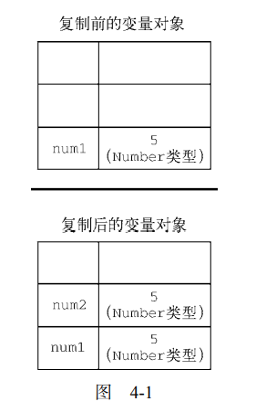
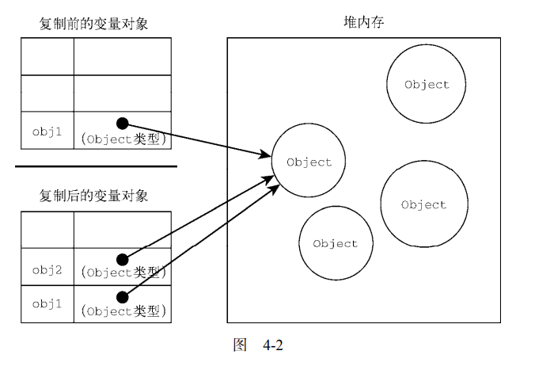
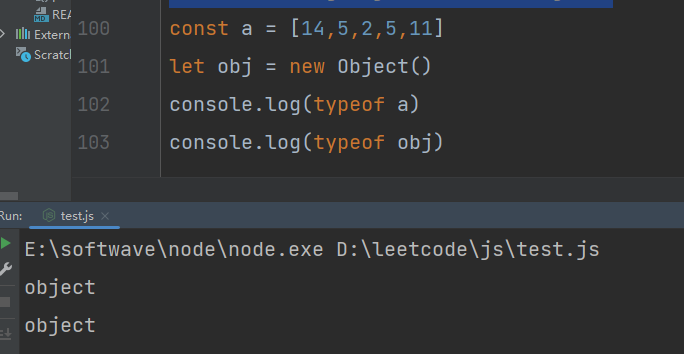
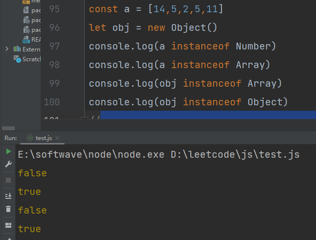
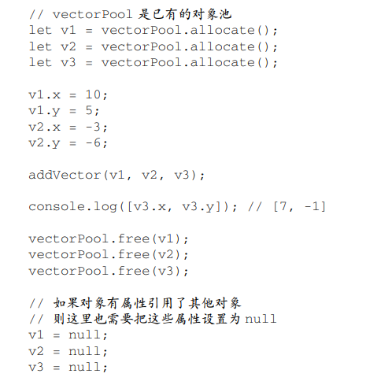

# 第4章 变量、作用域与内存
## 4.1 原始值与引用值
原始值：6种引用值（undefined、Null、Boolean、Number、String和Symbol）
引用值：多个值构成的对象

> 与其他语言不同，Javascript不允许直接访问内存位置，因此也就不能直接操作对象所在的内存空间。

### 4.1.1 动态属性
### 4.1.2 复制值
1、原始值复制

    let num1 = 5; 
    let num2 = num1;

图像表示：

2、引用值复制

    let obj1 = new Object(); 
    let obj2 = obj1; 
    obj1.name = "Nicholas"; 
    console.log(obj2.name); // "Nicholas" 

图像表示：

### 4.1.3 传递参数

> ECMAScript 中所有函数的参数都是**按值传递**的。
> 
> 如果是原始值，那么就跟原始值变量的复制一样，如果是
引用值，那么就跟引用值变量的复制一样。

### 4.1.4 确定类型
>我们通常不关心一个值是不是对象，
而是想知道它是什么类型的对象。

1、typeof:Array和Object类型都返回Object

2、instanceof：

result = variable instanceof constructor

如果变量是给定引用类型的实例，则 instanceof 操作符返回 true。来看下面的例子：

    console.log(person instanceof Object); // 变量 person 是 Object 吗？
    console.log(colors instanceof Array); // 变量 colors 是 Array 吗？
    console.log(pattern instanceof RegExp); // 变量 pattern 是 RegExp 吗？

## 4.2 执行上下文与作用域

### 4.2.1 作用域链增强
虽然执行上下文主要有全局上下文和函数上下文两种（eval()调用内部存在第三种上下文），但有
其他方式来增强作用域链。某些语句会导致在作用域链前端临时添加一个上下文，这个上下文在代码执
行后会被删除。通常在两种情况下会出现这个现象，即代码执行到下面任意一种情况时：

- try/catch 语句的 catch 块
- with 语句

这两种情况下，都会在作用域链前端添加一个变量对象。对 with 语句来说，会向作用域链前端添
加指定的对象；对 catch 语句而言，则会创建一个新的变量对象，这个变量对象会包含要抛出的错误
对象的声明。

### 4.2.1 变量声明

var：函数作用域，如果未声明就调用，var会提升变量，不报错，但不推荐、
let：块级作用域，在{}之间有效，let在同一作用域中不能声明俩次，var可以重复声明。
const：块级作用域，声明的同时必须同时初始化

标识符查找：访问局部变量要比全局变量要快，因为不用切换作用域。

## 4.3 垃圾回收
JavaScript 是使用垃圾回收的语言，也就是说执行环境负责在代码执行时管理内存。

通过自动内存管理实现内存分配和闲置资源回收。基本思路很简单：确定哪个变量不会再
使用，然后释放它占用的内存。这个过程是周期性的，即垃圾回收程序每隔一定时间（或者说在代码执
行过程中某个预定的收集时间）就会自动运行。

垃圾回收程序必须跟踪记录哪个变量还会使用，以及哪个变量不会再使用，以便回收
内存。如何标记未使用的变量也许有不同的实现方式。在浏览器的发展史上，用到过两种主要的
标记策略：**标记清理**和**引用计数**。

### 4.3.1 标记清理

JavaScript 最常用的垃圾回收策略是标记清理（mark-and-sweep）。当变量进入上下文，比如在函数
内部声明一个变量时，这个变量会被加上存在于上下文中的标记。

给变量加标记的方式有很多种。比如，当变量进入上下文时，反转某一位；或者可以维护“在上下
文中”和“不在上下文中”两个变量列表，可以把变量从一个列表转移到另一个列表。

垃圾回收程序运行的时候，会标记内存中存储的所有变量（记住，标记方法有很多种）。然后，它
会将所有在上下文中的变量，以及被在上下文中的变量引用的变量的标记去掉。在此之后再被加上标记
的变量就是待删除的了，原因是任何在上下文中的变量都访问不到它们了。随后垃圾回收程序做一次**内存清理**，销毁带标记的所有值并收回它们的内存。

### 4.3.2 引用计数（问题较多，用的少）
其思路是对每个值都记录它被引用的次数。声明变量并给它赋一个引用值时，这个值的引用数为 1。如果同一个值又被赋给另一个变
量，那么引用数加 1。类似地，如果保存对该值引用的变量被其他值给覆盖了，那么引用数减 1。当一
个值的引用数为 0 时，就说明没办法再访问到这个值了，因此可以安全地收回其内存了。垃圾回收程序
下次运行的时候就会释放引用数为 0 的值的内存。

### 4.3.3 性能

垃圾回收程序会周期性运行，如果内存中分配了很多变量，则可能造成性能损失，因此垃圾回收的
时间调度很重要。

**举例：**

由于调度垃圾回收程序方面的问题会导致性能下降，IE 曾饱受诟病。它的策略是**根据分配数**，比如分配了 256 个变量、4096 个对象/数组字面量和数组槽位（slot），或者 64KB 字符串。只要满足其中某个
条件，垃圾回收程序就会运行。这样实现的问题在于，分配那么多变量的脚本，很可能在其整个生命周期内始终需要那么多变量，结果就会导致垃圾回收程序过于频繁地运行。由于对性能的严重影响，IE7
最终更新了垃圾回收程序。

IE7 发布后，JavaScript 引擎的垃圾回收程序被调优为**动态改变分配变量、字面量或数组槽位等会触
发垃圾回收的阈值**。IE7 的起始阈值都与 IE6 的相同。如果垃圾回收程序回收的内存不到已分配的 15%，
这些变量、字面量或数组槽位的阈值就会翻倍。如果有一次回收的内存达到已分配的 85%，则阈值重置
为默认值。这么一个简单的修改，极大地提升了重度依赖 JavaScript 的网页在浏览器中的性能。

### 4.3.4 内存管理
将内存占用量保持在一个较小的值可以让页面性能更好。优化内存占用的最佳手段就是保证在执行
代码时只保存必要的数据。如果数据不再必要，那么把它设置为 null，从而释放其引用。这也可以叫
作解除引用。这个建议最适合全局变量和全局对象的属性。

> 不过要注意，解除对一个值的引用并不会自动导致相关内存被回收。解除引用的关键在于确保相关
的值已经不在上下文里了，因此它在下次垃圾回收时会被回收。

1、使用const和let声明提升性能

const和let都是以块为作用域，相较于var，使用这两个关键字可能会更早的让垃圾回收程序介入，尽早回收内存。

2、隐藏类和删除操作

V8 在将解释后的 JavaScript代码编译为实际的机器码时会利用“隐藏类”。

3、内存泄露

1）意外声明全局变量

是最常见但也最容易修复的内存泄漏问题。下面的代码没有使用任何关键字声明
变量：

    function setName() { 
     name = 'Jake'; 
    }

此时，解释器会把变量 name 当作 window 的属性来创建（相当于 window.name = 'Jake'）。
可想而知，在 window 对象上创建的属性，只要 window 本身不被清理就不会消失。这个问题很容易
解决，只要在变量声明前头加上 var、let 或 const 关键字即可，这样变量就会在函数执行完毕后离
开作用域。

2）定时器也可能会悄悄地导致内存泄漏

下面的代码中，定时器的回调通过闭包引用了外部变量：
let name = 'Jake'; 
setInterval(() => { 
 console.log(name); 
}, 100); 
只要定时器一直运行，回调函数中引用的 name 就会一直占用内存。垃圾回收程序当然知道这一点，
因而就不会清理外部变量。

4、静态分配与对象池

举例：这是一个计算二维矢量加法的函数

    function addVector(a, b) { 
     let resultant = new Vector(); 
     resultant.x = a.x + b.x; 
     resultant.y = a.y + b.y; 
     return resultant; 
    } 

调用这个函数时，**会在堆上创建一个新对象**，然后修改它，最后再把它返回给调用者。如果这个
矢量对象的生命周期很短，那么它会很快失去所有对它的引用，成为可以被回收的值。假如这个矢量
加法函数频繁被调用，那么垃圾回收调度程序会发现这里对象更替的速度很快，从而会更频繁地安排
垃圾回收。

该问题的解决方案是**不要动态创建矢量对象**，比如可以修改上面的函数，让它使用一个已有的矢量
对象：

    function addVector(a, b, resultant) { 
     resultant.x = a.x + b.x; 
     resultant.y = a.y + b.y; 
     return resultant; 
    }

那么在哪里创 建矢量可以不让垃圾回收调度程序盯上呢？

一个策略是使用对象池。

在初始化的某一时刻，可以创建一个对象池，用来管理一组可回收的对象。

应用程序可以向这个对象池请求一个对象、设置其属性、使用它，然后在操作完成后再把它还给对象池。
由于没发生对象初始化，垃圾回收探测就不会发现有对象更替，因此垃圾回收程序就不会那么频繁地运
行。下面是一个对象池的伪实现：

**注意 静态分配是优化的一种极端形式。如果你的应用程序被垃圾回收严重地拖了后腿，
可以利用它提升性能。**