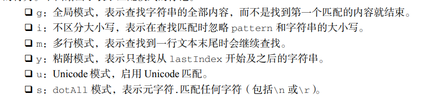
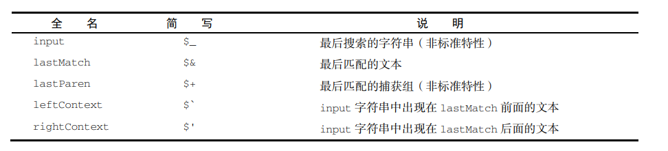
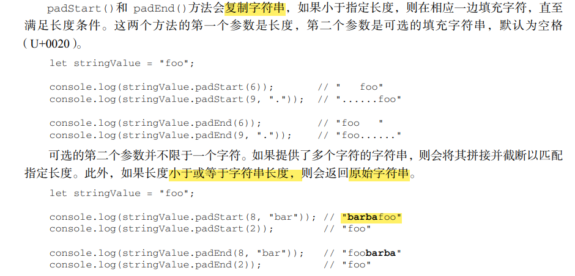

# 第5章 基本引用类型

> 引用类型虽然有点像类，但跟类并不是一个概念。

对象被认为是某个特定引用类型的实例。新对象通过使用 new 操作符后跟一个构造函数（constructor）
来创建。构造函数就是用来创建新对象的函数，比如下面这行代码：

    let now = new Date(); 

这行代码创建了引用类型 Date 的一个新实例，并将它保存在变量 now 中。Date()在这里就是构
造函数，它负责创建一个只有默认属性和方法的简单对象。

## 5.1 Date
1、Date

    let now = new Date();

2、Date.parse()

Date.parse()方法接收一个表示日期的字符串参数，尝试将这个字符串转换为表示该日期的毫秒
数。

    let someDate = new Date(Date.parse("May 23, 2019"));

3、Date.UTC()

Date.UTC()方法也返回日期的毫秒表示，但使用的是跟 Date.parse()不同的信息来生成这个值。
传给 Date.UTC()的参数是年、零起点月数（1 月是 0，2 月是 1，以此类推）、日（1~31）、时（0~23）、
分、秒和毫秒。这些参数中，只有前两个（年和月）是必需的。如果不提供日，那么默认为 1 日。其他
参数的默认值都是 0。

    // GMT 时间 2000 年 1 月 1 日零点
    let y2k = new Date(Date.UTC(2000, 0)); 

    // GMT 时间 2005 年 5 月 5 日下午 5 点 55 分 55 秒
    let allFives = new Date(Date.UTC(2005, 4, 5, 17, 55, 55));

### 5.1.1 继承的方法
Date 类型重写了 toLocaleString()、toString()和 valueOf()方法。
1、toLocaleString()

    const today = new Date();
    const localizedDateString = today.toLocaleString();
    console.log(localizedDateString); // 输出格式由本地环境决定

2、toString()

    const today = new Date();
    const utcDateString = today.toString();
    console.log(utcDateString); // 输出格式为 "Day Month Date Year HH:MM:SS GMT+0800 (时区)"


3、valueOf()

    const today = new Date();
    const timestamp = today.valueOf();
    console.log(timestamp); // 输出当前日期和时间的时间戳

三者的测试结果：


### 5.1.2 日期格式化方法


## 5.2 RegExp(正则表达式)

**1、exec()**

RegExp 实例的主要方法是 exec()，主要用于配合捕获组使用。这个方法只接收一个参数，即要应
用模式的字符串。如果找到了匹配项，则返回包含第一个匹配信息的数组；如果没找到匹配项，则返回
null。返回的数组虽然是 Array 的实例，但包含两个额外的属性：index 和 input。index 是字符串
中匹配模式的起始位置，input 是要查找的字符串。这个数组的第一个元素是匹配整个模式的字符串，
其他元素是与表达式中的捕获组匹配的字符串。

**2、test()**

如果输入的文本与模式匹配，则参数返回 true，否则返回 false。这个方法适用于只想测试模式是否匹配。

### 5.2.3 RegExp构造函数属性



    let text = "this has been a short summer"; 
    let pattern = /(.)hort/g; 
    if (pattern.test(text)) { 
     console.log(RegExp.input); // this has been a short summer 
     console.log(RegExp.leftContext); // this has been a 
     console.log(RegExp.rightContext); // summer 
     console.log(RegExp.lastMatch); // short 
     console.log(RegExp.lastParen); // s 
    }

简写方式：
````
let text = "this has been a short summer"; 
let pattern = /(.)hort/g; 
/* 
 * 注意：Opera 不支持简写属性名
 * IE 不支持多行匹配
 */ 
if (pattern.test(text)) { 
 console.log(RegExp.$_); // this has been a short summer 
 console.log(RegExp["$`"]); // this has been a 
 console.log(RegExp["$'"]); // summer 
 console.log(RegExp["$&"]); // short 
 console.log(RegExp["$+"]); // s 
}
````

### 5.2.４ 模式局限

## 5.3 原始值包装类型
### 5.3.1 Boolean

    let falseObject = new Boolean(false); //Boolean对象（不建议使用）
    let result = falseObject && true; 
    console.log(result); // true 

    let falseValue = false;  //Boolean原始值
    result = falseValue && true; 
    console.log(result); // false 

在这段代码中，我们创建一个值为 false 的 Boolean 对象。然后，在一个布尔表达式中通过&&操
作将这个对象与一个原始值 true 组合起来。在布尔算术中，false && true 等于 false。可是，这
个表达式是对 falseObject 对象而不是对它表示的值（false）求值。

> 所有对象在布尔表达式中都会自动转换为 true，因此 falseObject 在这个表达式里实际上表示一个 true 值。那么
true && true 当然是 true。

### 5.3.2 Number 
1、toString()方法

    let num = 10; 
    console.log(num.toString()); // "10" 
    console.log(num.toString(2)); // "1010" 
    console.log(num.toString(8)); // "12" 
    console.log(num.toString(10)); // "10" 
    console.log(num.toString(16)); // "a" 

2、toFixed()

toFixed()方法返回包含指定小数点位数的数值字符串，如：

    let num = 10; 
    console.log(num.toFixed(2)); // "10.00" (2表示保留两位小时)

3、toExponential()

返回以科学记数法（也称为指数记数法）表示的数值字符串。与 toFixed()一样，toExponential()也接收一个参数，表示结果中小数的位数。
来看下面的例子：

    let num = 10; 
    console.log(num.toExponential(1)); // "1.0e+1"

4、toPrecision()

toPrecision()方法会根据情况返回最合理的输出结果，可能是固定长度，也可能是科学记数法形式。

本质上，toPrecision()方法会根据数值和精度来决定调用 toFixed()还是 toExponential()。

这个方法接收一个参数，表示结果中数字的总位数（不包含指数）。举例：
    
    let num = 99; 
    console.log(num.toPrecision(1)); // "1e+2" 
    console.log(num.toPrecision(2)); // "99" 
    console.log(num.toPrecision(3)); // "99.0"

5、isInteger()

用于辨别一个数值是否保存为整数。有时候，小数位的 0 可能会让人误以为数值是一个浮点值：
    
    console.log(Number.isInteger(1)); // true 
    console.log(Number.isInteger(1.00)); // true 
    console.log(Number.isInteger(1.01)); // false 

6、isSafeInteger()

用于辨别整数是否在 Number.MIN_SAFE_INTEGER（-2^53 + 1）到 Number.MAX_SAFE_INTEGER（2^53 - 1）中。

    console.log(Number.isSafeInteger(-1 * (2 ** 53))); // false 
    console.log(Number.isSafeInteger(-1 * (2 ** 53) + 1)); // true 

    console.log(Number.isSafeInteger(2 ** 53)); // false 
    console.log(Number.isSafeInteger((2 ** 53) - 1)); // true

### 5.3.3 String
1、Javascript字符
- length() 返回长度
- charAt() 返回给定索引位置的字符

`    let message = "abcde"; 
    console.log(message.charAt(2)); // "c"`

- charCodeAt() 查看指定码元的字符编码

    `let message = "abcde"; 
    // Unicode "Latin small letter C"的编码是 U+0063 
    console.log(message.charCodeAt(2)); // 99 
    // 十进制 99 等于十六进制 63 
    console.log(99 === 0x63); // true `

- fromCharCode() 根据给定的 UTF-16 码元创建字符串中的字符

    `console.log(String.fromCharCode(0x61, 0x62, 0x63, 0x64, 0x65)); // "abcde" 
    console.log(String.fromCharCode(97, 98, 99, 100, 101)); // "abcde" `

2、normalize()

3、字符串操作方法

- concat() 将一个或多个字符串拼接成一个新字符串
- slice()
- substr()
- concat()

```
let string = "hello world"
console.log(string.slice(2))
console.log(string.slice(2,4)) //包头不包尾
console.log(string.slice(-2))

console.log(string.substring(2))
console.log(string.substring(2,4))//包头不包尾
console.log(string.substring(-2)) //将所有 负参数 转换为 0

console.log(string.substr(2))
console.log(string.substr(2,4))// 包头包尾
console.log(string.substr(-2)) // 第一个负参数值当成字符串长度加上该值，将第二个负参数值转换为 0
```
4、字符串位置方法

- indexOf() : 从字符串开头开始查找子字符串，并返回位置
- lastIndexOf() : 从字符串末尾开始查找子字符串，并返回位置

```
let stringValue = "hello world"; 
console.log(stringValue.indexOf("o")); // 4 
console.log(stringValue.lastIndexOf("o")); // 7 倒的搜第一次出现“o”的位置
```

```
let a = "hello world"
console.log(a.indexOf("l",4)) //从位置4开始搜索 “l”的位置

console.log(a.lastIndexOf("l",7)) //从位置7开始搜索 “l”的位置 倒的开始搜索第一次出现“l”的位置
```
5、字符串包含方法

- startWith():检查开始于索引 0 的匹配项
- endWith():检查开始于索引(string.length - substring.length)的匹配项
- includes():检查整个字符串

```
let message = "foobarbaz"; 
console.log(message.startsWith("foo")); // true 
console.log(message.startsWith("bar")); // false 
console.log(message.endsWith("baz")); // true 
console.log(message.endsWith("bar")); // false 
console.log(message.includes("bar")); // true 
console.log(message.includes("qux")); // false
```
startsWith()和 includes()方法接收可选的第二个参数，表示开始搜索的位置。如果传入第二
个参数，则意味着这两个方法会从指定位置向着字符串末尾搜索，忽略该位置之前的所有字符。下面是
一个例子：

```
let message = "foobarbaz"; 
console.log(message.startsWith("foo")); // true 
console.log(message.startsWith("foo", 1)); // false 
console.log(message.includes("bar")); // true 
console.log(message.includes("bar", 4)); // false
```
endsWith()方法接收可选的第二个参数，表示应该当作字符串末尾的位置。如果不提供这个参数，
那么默认就是字符串长度。如果提供这个参数，那么就好像字符串只有那么多字符一样。

6、trim()方法

这个方法会创建字符串的一个副本（**原字符串不受影响**），删除前、后所有空格符，再返回结果。

**trimLeft()和 trimRight()**方法分别用于从字符串开始和末尾清理空格符。

7、repeat()方法

这个方法接收一个整数参数，表示要将字符串复制多少次，然后返回拼接所有副本后的结果。
````
  let stringValue = "na "; 
  console.log(stringValue.repeat(16) + "batman"); 
  // na na na na na na na na na na na na na na na na batman 
````
8、padStart() 和 padEnd()方法



9、字符串迭代与解构

字符串的原型上暴露了一个@@iterator 方法，表示可以迭代字符串的每个字符。可以像下面这样
手动使用迭代器：

  ```
  let message = "abc"; 
  let stringIterator = message[Symbol.iterator](); 
  
  console.log(stringIterator.next()); // {value: "a", done: false} 
  console.log(stringIterator.next()); // {value: "b", done: false} 
  console.log(stringIterator.next()); // {value: "c", done: false} 
  console.log(stringIterator.next()); // {value: undefined, done: true}
  ```
在 for-of 循环中可以通过这个迭代器按序访问每个字符：
```
for (const c of "abcde") { 
 console.log(c); 
} 
// a 
// b 
// c 
// d 
// e 
```

分割字符串：
```angular2html
  let message = "abcde"; 
  console.log([...message]); // ["a", "b", "c", "d", "e"]
```

10、字符串大小写转换

- toLowerCase() 和 toLocaleLowerCase()

- toUpperCase() 和 toLocaleUpperCase()

11、字符串模式匹配方法

- match()方法 （ 和RegExp对象的exec()方法相同 ）
- search()方法
```
let text = "cat, bat, sat, fat"; 
let pos = text.search(/at/); 
console.log(pos); // 1 
```
这里，search(/at/)返回 1，即"at"的第一个字符在字符串中的位置。
 
- replace()
```angular2html
let text = "cat, bat, sat, fat"; 
let result = text.replace("at", "ond"); 
console.log(result); // "cond, bat, sat, fat" 
result = text.replace(/at/g, "ond"); 
console.log(result); // "cond, bond, sond, fond"
```
12、localCompare()
- 比较两个字符串
  - 如果按照字母表顺序，字符串应该排在字符串参数前头，则返回负值。（通常是-1，具体还要看
与实际值相关的实现。）
  - 如果字符串与字符串参数相等，则返回 0。
  - 如果按照字母表顺序，字符串应该排在字符串参数后头，则返回正值。（通常是 1，具体还要看
与实际值相关的实现。
  - 
```javascript
  let stringValue = "yellow"; 
  
  console.log(stringValue.localeCompare("brick")); // 1 
  console.log(stringValue.localeCompare("yellow")); // 0 
  console.log(stringValue.localeCompare("zoo")); // -1 
  
```

13、HTML方法
## 5.4 单例内置对象
### 5.4.1 Global
1、URL编码方法
- encodeURI():encodeURI()不会编码属于 URL 组件的特殊字符，比如冒号、斜杠、问号、
井号
- encodeURIComponent():会编码它发现的所有非标准字符

举例：
```
  let uri = "http://www.wrox.com/illegal value.js#start"; 
  // "http://www.wrox.com/illegal%20value.js#start" 
  console.log(encodeURI(uri)); 
  
  // "http%3A%2F%2Fwww.wrox.com%2Fillegal%20value.js%23start" 
  console.log(encodeURIComponent(uri));
```  

- decodeURI(): 只对使用 encodeURI()编码过的字符解码
- decodeURIComponent():解码所有被 encodeURIComponent()编码的字符，基本上就是解码所有特殊值。

2、eval()方法

```javascript
eval("console.log('hi')"); 
```
上面这行代码的功能与下一行等价：

`console.log("hi");`

3、Global对象属性

4、window对象

虽然 ECMA-262 没有规定直接访问 Global 对象的方式，但浏览器将 window 对象实现为 Global
对象的代理。

```javascript
var color = "red"; 
function sayColor() { 
 console.log(window.color); 
} 
window.sayColor(); // "red"
```

这里定义了一个名为color的全局变量和一个名为sayColor()的全局函数。在sayColor()内部，
通过 window.color 访问了 color 变量，说明全局变量变成了 window 的属性。接着，又通过 window
对象直接调用了 window.sayColor()函数，从而输出字符串。

另一种获取 Global 对象的方式是使用如下的代码：
```javascript
let global = function() { 
 return this; 
}();
```

这段代码创建一个立即调用的函数表达式，返回了 this 的值。如前所述，当一个函数在没有明确
（通过成为某个对象的方法，或者通过 call()/apply()）指定 this 值的情况下执行时，this 值等于
Global 对象。因此，调用一个简单返回 this 的函数是在任何执行上下文中获取 Global 对象的通用
方式。

### 5.4.2 Math

