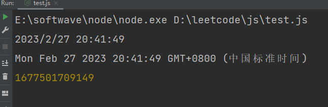
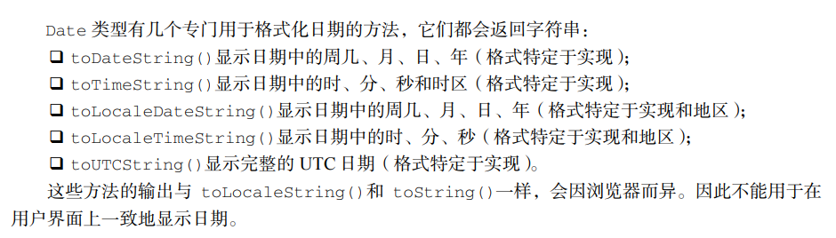

# 第5章 基本引用类型

> 引用类型虽然有点像类，但跟类并不是一个概念。

对象被认为是某个特定引用类型的实例。新对象通过使用 new 操作符后跟一个构造函数（constructor）
来创建。构造函数就是用来创建新对象的函数，比如下面这行代码：

    let now = new Date(); 

这行代码创建了引用类型 Date 的一个新实例，并将它保存在变量 now 中。Date()在这里就是构
造函数，它负责创建一个只有默认属性和方法的简单对象。

## 5.1 Date
1、Date

    let now = new Date();

2、Date.parse()

Date.parse()方法接收一个表示日期的字符串参数，尝试将这个字符串转换为表示该日期的毫秒
数。

    let someDate = new Date(Date.parse("May 23, 2019"));

3、Date.UTC()

Date.UTC()方法也返回日期的毫秒表示，但使用的是跟 Date.parse()不同的信息来生成这个值。
传给 Date.UTC()的参数是年、零起点月数（1 月是 0，2 月是 1，以此类推）、日（1~31）、时（0~23）、
分、秒和毫秒。这些参数中，只有前两个（年和月）是必需的。如果不提供日，那么默认为 1 日。其他
参数的默认值都是 0。

    // GMT 时间 2000 年 1 月 1 日零点
    let y2k = new Date(Date.UTC(2000, 0)); 

    // GMT 时间 2005 年 5 月 5 日下午 5 点 55 分 55 秒
    let allFives = new Date(Date.UTC(2005, 4, 5, 17, 55, 55));

### 5.1.1 继承的方法
Date 类型重写了 toLocaleString()、toString()和 valueOf()方法。
1、toLocaleString()

    const today = new Date();
    const localizedDateString = today.toLocaleString();
    console.log(localizedDateString); // 输出格式由本地环境决定

2、toString()

    const today = new Date();
    const utcDateString = today.toString();
    console.log(utcDateString); // 输出格式为 "Day Month Date Year HH:MM:SS GMT+0800 (时区)"

3、valueOf()

    const today = new Date();
    const timestamp = today.valueOf();
    console.log(timestamp); // 输出当前日期和时间的时间戳

三者的测试结果：

### 5.1.2 日期格式化方法

## 5.2 RegExp
