# 第6章 集合引用类型
## 6.1 Object
1、new操作符
2、对象字面量
```javascript
let person = { 
 name: "Nicholas", 
 age: 29 
}; 
```
## 6.2 Array
> 跟其他语言中的数组一样，ECMAScript 数组也是一组有序的数据，但跟其他语言
不同的是，数组中每个槽位可以存储任意类型的数据。

### 6.2.1 创建数组
1、Array构造函数
```javascript
let colors = new Array(3);//创建一个包含3个元素的数组
```
2、数组字面量
```javascript
let names = [] //创建一个空数组
```
- Array.from():用于将类数组结构转换为数组实例

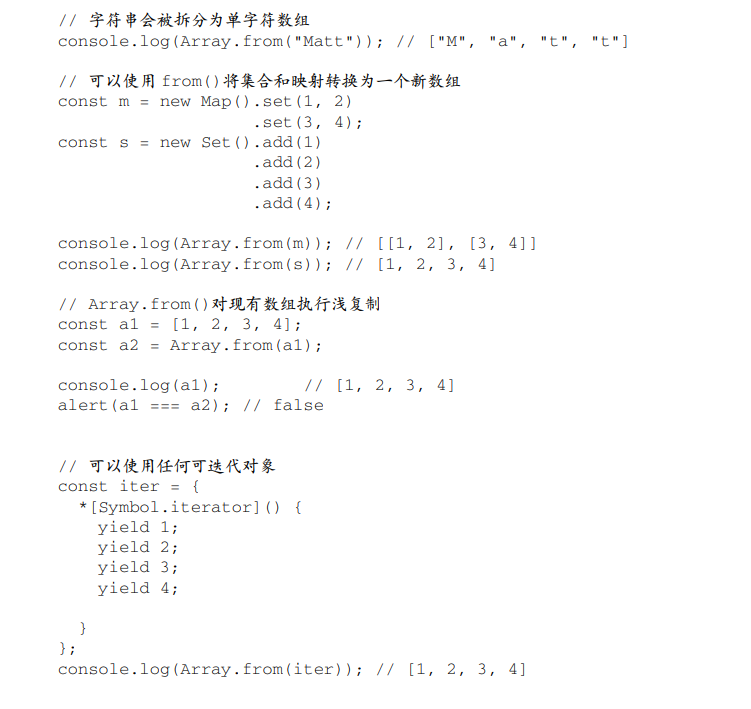

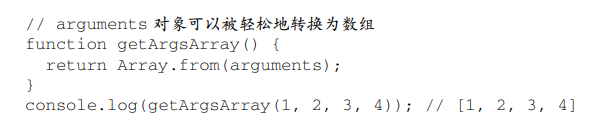
- Array.of():用于将一组参数转换为数组实例

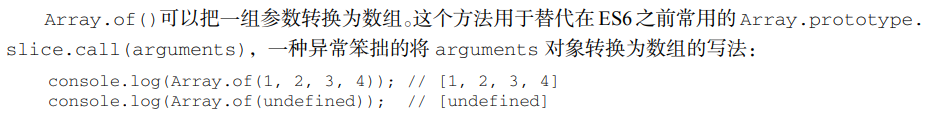
### 6.2.2 数组空位
使用数组字面量初始化数组时，可以使用一串逗号来创建空位（hole）。

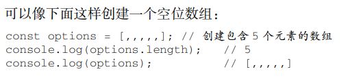
### 6.2.3 数组索引
1、如果把一个值设置给超过数组最大索引的索引，就像示例中的 colors[3]，则数组长度会自动扩
展到该索引值加 1（示例中设置的索引 3，所以数组长度变成了 4）

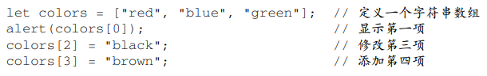

2、数组 colors 一开始有 3 个值。将 length 设置为 2，就删除了最后一个（位置 2 的）值，
因此 colors[2]就没有值了。

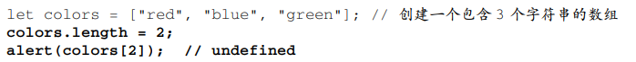
### 6.2.4 检测数组
下面两个方法在判断一个对象是否是数组。
- instanceof

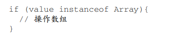
- Array.isArray()


### 6.2.5 迭代器方法
在 ES6 中，Array 的原型上暴露了 3 个用于检索数组内容的方法：keys()、values()和
entries()。keys()返回数组索引的迭代器，values()返回数组元素的迭代器，而 entries()返回
索引/值对的迭代器：

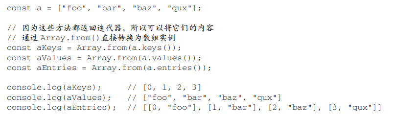

如果直接打印，只会显示迭代器：


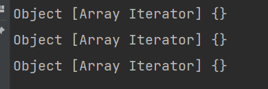
### 6.2.6 复制和填充方法
- fill()
使用 fill()方法可以向一个已有的数组中插入全部或部分相同的值。开始索引用于指定开始填充
的位置，它是可选的。如果不提供结束索引，则一直填充到数组末尾。负值索引从数组末尾开始计算。
也可以将负索引想象成数组长度加上它得到的一个正索引：

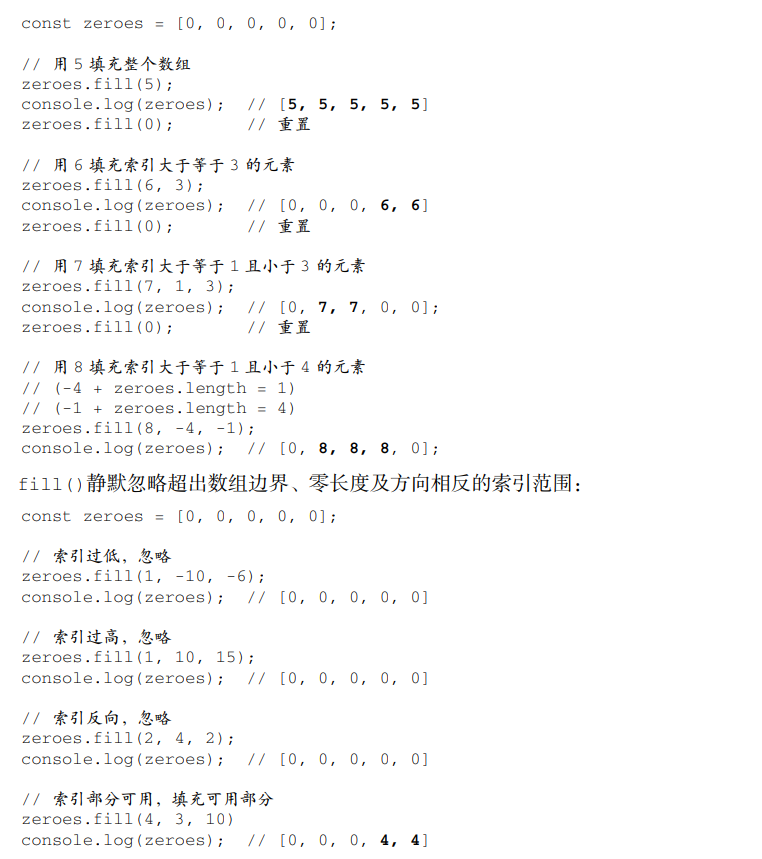
- copyWithin()
与 fill()不同，copyWithin()会按照指定范围浅复制数组中的部分内容，然后将它们插入到指
定索引开始的位置。开始索引和结束索引则与 fill()使用同样的计算方法：

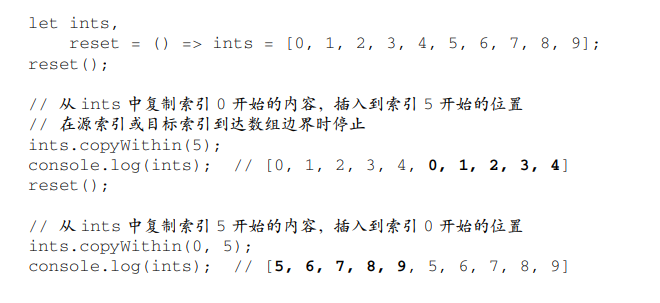
### 6.2.7 转换方法
- valueOf()：返回的是数组本身
```javascript
let colors = ["red", "blue", "green"]; // 创建一个包含 3 个字符串的数组
alert(colors.valueOf()); // red,blue,green
```
- toString()：返回由数组中每个值的等效字符串拼接而成的一个逗号分割的字符串。也就是说，对数组的每个值都会调用其 toString()方法，以得到最终的字符串。
- toLocaleString()：在调用数组的toLocaleString()方法时，会得到一个逗号分隔的数组值的字符串。它与另外两个方法
唯一的区别是，为了得到最终的字符串，会调用数组每个值的 toLocaleString()方法，而不是
toString()方法。


- join()：分割字符串

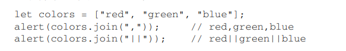
### 6.2.8 栈方法
- pop()
- push()
### 6.2.9 队列方法
- shift():它会删除数组的第一项并返回它，然后数组长度减1(从列表开头获取数据)。
- push():入队


- pop():出队
- unshift():在数组开头添加任意多个值，返回新的数组长度

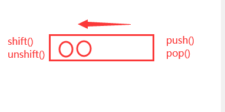
### 6.2.10 排序方法
- reverse():反向排列
- sort()：正向排列

但是，一开始数组中数值的顺序是正确的，但调用 sort()会按照**这些数值的字符串形式**重新排序。因此，
即使 5 小于 10，但字符串"10"在字符串"5"的前头，所以 10 还是会排到 5 前面。很明显，这在多数情
况下都不是最合适的。

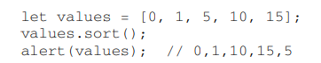
解决办法：

sort()方法可以接受一个比较函数，用于判断哪个值应该排在前面。
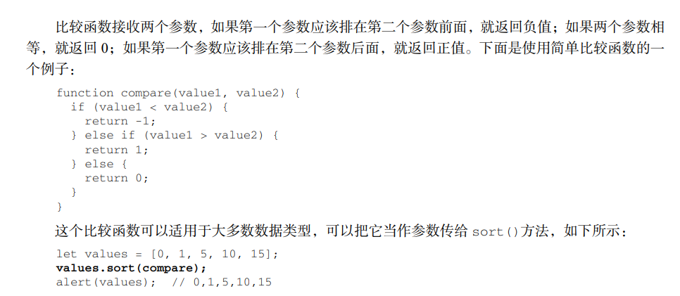

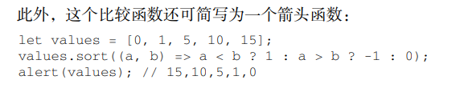

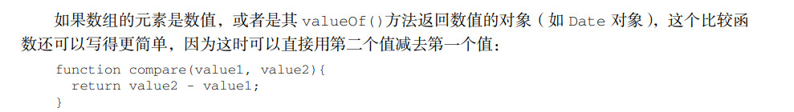

### 6.2.11 操作方法
- concat()：可以在现有数组全部元素基础上创建一个新数组。
打平数组参数的行为可以重写，方法是在参数数组上指定一个特殊的符号：Symbol.isConcatSpreadable。这个符号能够阻止 concat()打平参数数组。相反，把这个值设置为 true 可以强制打平
类数组对象：
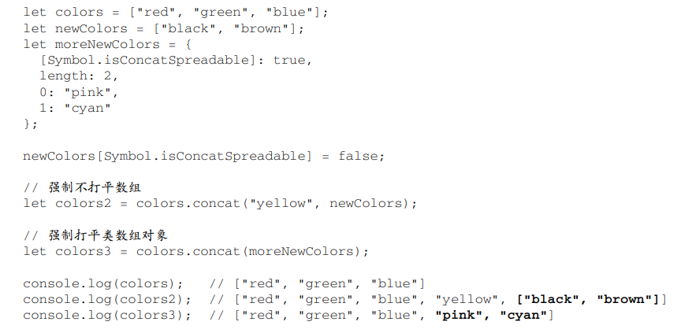
- slice()
  - 删除：需要给 splice()传 2 个参数：要删除的第一个元素的位置和要删除的元素数量。举例：splice(0, 2)会删除前两个元素
  - 插入：需要给 splice()传 3 个参数：开始位置、0（要删除的元素数量）和要插入的元素，可
以在数组中指定的位置插入元素。举例：splice(2, 0, "red", "green")会从数组位置 2 开始插入字符串
"red"和"green"。
  - 替换：splice()在删除元素的同时可以在指定位置插入新元素，同样要传入 3 个参数：开始位
置、要删除元素的数量和要插入的任意多个元素。举例：splice(2, 1, "red", "green")会在位置 2 删除一个元素，然后从该位置开始
向数组中插入"red"和"green"。
